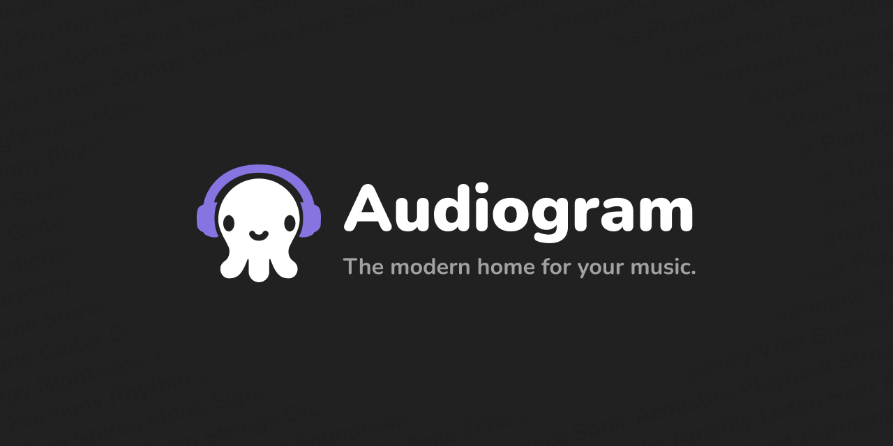

  <h1>Audiogram</h1>
  
<strong>A calm, beautiful music player for your own library.</strong>

  

    
    
  

  

Audiogram is a music player for people who still care about their own music collection.

It is made for local libraries, familiar albums, carefully saved tracks, and the small rituals around listening: finding the right song, reading the lyrics, keeping a queue, and enjoying a player that stays out of the way.

No feed. No noise. No account wall. Just your music.

## Why Audiogram

- **Your library feels like a library**  
  Albums, artists, playlists, favorites, and search are arranged around the way people actually browse music.

- **A player that feels personal**  
  Audiogram focuses on the current track, queue, lyrics, covers, and small details that make listening feel comfortable.

- **Works with your own files**  
  Keep listening to the music you already have, without turning your collection into someone else's service.

- **Made to be pleasant every day**  
  The interface is intentionally clean, quiet, and easy to live with.

## What You Can Do

- Build a local music library.
- Browse by artists, albums, playlists, and favorites.
- Search through your collection.
- Manage the current queue.
- View and attach lyrics.
- Edit track information such as title, artists, and album.
- Use Audiogram as a desktop music player.

## Support The Project

Audiogram is an independent project. If you like it and want to support its development, you can do it here:

  <a href="https://boosty.to/eg0rk"><strong>Support Audiogram on Boosty</strong></a>

Support helps keep the project alive, improve the app, polish the interface, and add new features.

## Contacts

For questions, paid work, company licensing, support, or development requests:

- Telegram: [@EG0RK13](https://t.me/EG0RK13)
- Email: [lambdawork1n@gmail.com](mailto:lambdawork1n@gmail.com)

## License

Audiogram uses a dual licensing model.

### Personal And Open-Source Use

For personal use, learning, experiments, and open-source use, Audiogram is available under the **GNU GPLv3** license. See [`LICENSE`](./LICENSE) for the full text.

### Companies And Commercial Use

For companies, teams, commercial use, private integrations, paid support, or custom development, a separate **commercial license** is available.

Commercial licensing can include paid support, feature development, maintenance, and adaptation of Audiogram for your needs.

To discuss commercial terms, contact me on Telegram or by email.
