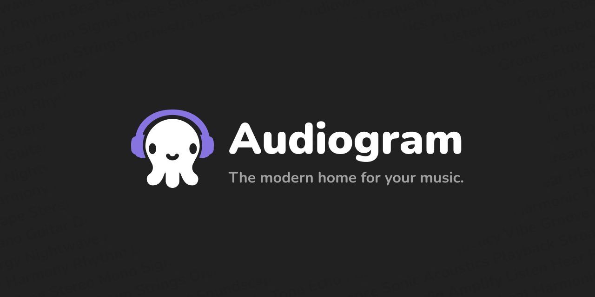

<div align="center">
  
  <h1>Audiogram</h1>
  <p><strong>Free, open-source music player for your own library: local files, Navidrome and YouTube in one app.</strong></p>
  <p>Windows · macOS · Linux · Android · Web (PWA)</p>

  <p>
    <a href="https://github.com/Eg0r0k/Audiogram/releases/latest"></a>
    <a href="https://github.com/Eg0r0k/Audiogram/releases"></a>
    <a href="https://www.gnu.org/licenses/gpl-3.0"></a>
    <a href="https://boosty.to/eg0rk"></a>
  </p>

  <p>
    <a href="#download"><strong>Download</strong></a> ·
    <a href="https://audiogram-58l.pages.dev"><strong>Try in browser</strong></a> ·
    <a href="#features">Features</a> ·
    <a href="#faq">FAQ</a> ·
    <a href="#build-from-source">Build from source</a>
  </p>

  
</div>

Audiogram is a desktop and mobile music player for people who keep their own music collection. It plays local files (MP3, FLAC, M4A/ALAC, OGG, Opus, WAV and more), connects to a self-hosted [Navidrome](https://www.navidrome.org/) or Subsonic server, and can search, stream and download music from YouTube. Everything ends up in the same library, so a local album, a Navidrome album and a YouTube playlist sit next to each other and go into the same queue.

There is no feed, no ads and no account. Your files stay on your disk and your listening history stays on your device.

## Features

### Library

Add folders or drop files in, or set up watched folders that Audiogram rescans on launch. The library is organized by artists, albums, playlists, liked songs and folders, with full-text search on top.

Local files, a Navidrome/Subsonic server and YouTube all live in the same library. A remote track can be pinned into a local playlist or downloaded for offline listening.

Tags (title, artist, album, cover) are editable in the app. Metadata comes straight from your files rather than from a cloud lookup.

Long files such as live sets, DJ mixes and audiobooks can be split into chapters, either by hand or by importing a CUE sheet.

Large libraries stay responsive: metadata is parsed in a background worker, lists are virtualized and the database is IndexedDB.

### Playback

Queue with shuffle, repeat and drag-to-reorder. Per-track playback speed. A 10-band equalizer with presets, fade in and fade out, and volume normalization for tracks that carry loudness metadata.

Synced lyrics: attach an `.lrc` file and the current line follows the music.

Sleep timer, audio output device selection, hardware media keys and global hotkeys. A mini mode on desktop and picture-in-picture in the browser for when you want the player out of the way.

### Discover

Listening statistics: time listened, streaks, top tracks, artists and genres, hour-of-day and completion charts, for a week, month, year or all time.

Recommendations are computed locally. Audio analysis (Essentia) runs on your machine, so suggestions come from your own collection and nothing gets uploaded.

### Desktop integration

Auto-update, launch at startup, close to tray, thumbbar controls on the Windows taskbar. Discord Rich Presence shows what you are listening to. YouTube search, streaming and downloads can go through a proxy of your choice.

Light, dark and system themes, accent colors, UI zoom.

## Supported formats

MP3, FLAC, M4A (AAC and ALAC), AAC, OGG Vorbis, Opus, WAV, WMA, WebM audio.
Lyrics: LRC. Chapters: CUE.

## Platforms

| Platform | Local files | Navidrome | YouTube | Notes |
| --- | :-: | :-: | :-: | --- |
| Windows (x64) | yes | yes | yes | installer, auto-update, tray, thumbbar |
| macOS (Intel + Apple Silicon) | yes | yes | yes | universal build |
| Linux (x64) | yes | yes | yes | AppImage |
| Android (arm64) | yes | yes | yes | APK, background playback |
| Web / PWA | yes | no | no | files are stored in the browser (OPFS), works offline |

## Download

Get the latest build from the [Releases page](https://github.com/Eg0r0k/Audiogram/releases/latest):

- Windows: `Audiogram_x.y.z_x64-setup.exe`
- macOS: `Audiogram_universal.app.tar.gz` (or the `.dmg` if present)
- Linux: `Audiogram_x.y.z_amd64.AppImage`
- Android: `Audiogram_x.y.z_aarch64.apk`
- Browser: [open the web version](https://audiogram-58l.pages.dev), nothing to install

> **Windows SmartScreen warning.** Audiogram is not code-signed yet, so Windows may show an "unknown publisher" prompt on first launch. Click *More info*, then *Run anyway*. Every release ships with a minisign signature (`.sig`) that the built-in updater checks before installing.

## FAQ

**Is it free?**
Yes. Audiogram is open source under GPLv3 for personal use. There is no paid tier, no telemetry and no account. If it's useful to you, you can [support development on Boosty](https://boosty.to/eg0rk).

**Does it replace Spotify or Apple Music?**
No. It's a player for music you already own or self-host, closer to foobar2000, MusicBee or Strawberry than to a streaming service, except that it also runs on Android and in the browser.

**Does YouTube work on Android or in the browser?**
On Android, yes: search, streaming and downloads work the same as on desktop. Not in the browser, where YouTube's servers refuse cross-origin requests. YouTube also sometimes blocks anonymous requests from a network (bot check); if that happens, a proxy can be set in Settings.

**YouTube stopped working after a while. What now?**
Update the app. YouTube changes its API every few weeks and the app talks to it directly (no `yt-dlp`), so an older build eventually stops resolving streams. Updates ship as soon as a change is caught.

**Where is my library stored?**
In the desktop and Android apps: on disk in the app data folder, with an IndexedDB database for metadata. In the browser: in the origin's private file system (OPFS). Nothing leaves your device in either case.

**Can I use my Navidrome/Subsonic server?**
Yes. Enter the server URL and credentials in *Settings > Music sources*. Navidrome playlists are read-only, but any Navidrome track can be added to a local playlist or downloaded.

## Build from source

Requirements: [Node.js](https://nodejs.org/) 20+, [pnpm](https://pnpm.io/), [Rust](https://rustup.rs/) stable and the [Tauri v2 prerequisites](https://v2.tauri.app/start/prerequisites/) for your OS.

```bash
git clone https://github.com/Eg0r0k/Audiogram.git
cd Audiogram
pnpm install

pnpm tauri dev          # desktop app in dev mode
pnpm tauri build        # production desktop bundle
pnpm dev                # web version on http://localhost:1420
pnpm tauri android dev  # Android (needs Android SDK + NDK)
```

### Tech stack

[Tauri v2](https://v2.tauri.app/) (Rust) · [Vue 3](https://vuejs.org/) + TypeScript · Pinia · [TanStack Query](https://tanstack.com/query) · [Dexie](https://dexie.org/) (IndexedDB) · [lyra-audio](https://www.npmjs.com/package/lyra-audio) for playback · Tailwind CSS · Vitest

## Roadmap

- LAN sync of the library between devices, without a server
- Portable Windows build
- Code signing for Windows and macOS builds
- Better recommendations (done)

Found a bug or have an idea? [Open an issue](https://github.com/Eg0r0k/Audiogram/issues).

## Support the project

Audiogram is built by one person in spare time. If you like it, you can help keep it going:

<p>
  <a href="https://boosty.to/eg0rk"><strong>Support Audiogram on Boosty</strong></a>
</p>

Starring the repo and showing the app to a friend helps too.

## Contacts

For questions, paid work, company licensing, support or development requests:

- Telegram: [@EG0RK13](https://t.me/EG0RK13)
- Email: [lambdawork1n@gmail.com](mailto:lambdawork1n@gmail.com)

## License

Audiogram uses a dual licensing model.

### Personal and open-source use

For personal use, learning, experiments and open-source use, Audiogram is available under the **GNU GPLv3** license. See [`LICENSE`](./LICENSE) for the full text.

### Companies and commercial use

For companies, teams, commercial use, private integrations, paid support or custom development, a separate **commercial license** is available. It can include paid support, feature development, maintenance and adaptation of Audiogram for your needs.

To discuss commercial terms, contact me on Telegram or by email.
